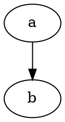

## Create Table Statement
* Tabellenname
* Spalten und ihre Datentypen
* Constraints (NOT NULL, (Fremd-)Schlüssel, CHECK)

### Beispiel:
Umwandlung von 

STUDENTEN(#SID, VORNAME, NACHNAME, EMAIL?)

in
```sql
CREATE TABLE STUDENTEN (
	SID NUMERIC(3) NOT NULL PRIMARY KEY CHECK(SID>0),
	VORNAME VARCHAR(20) NOT NULL,
	NACHNAME VARCHAR(20) NOT NULL,
	EMAIL VARCHAR(128),
	UNIQUE(VORNAME, NACHNAME)
)
```


```plantuml

```

#unfinished 